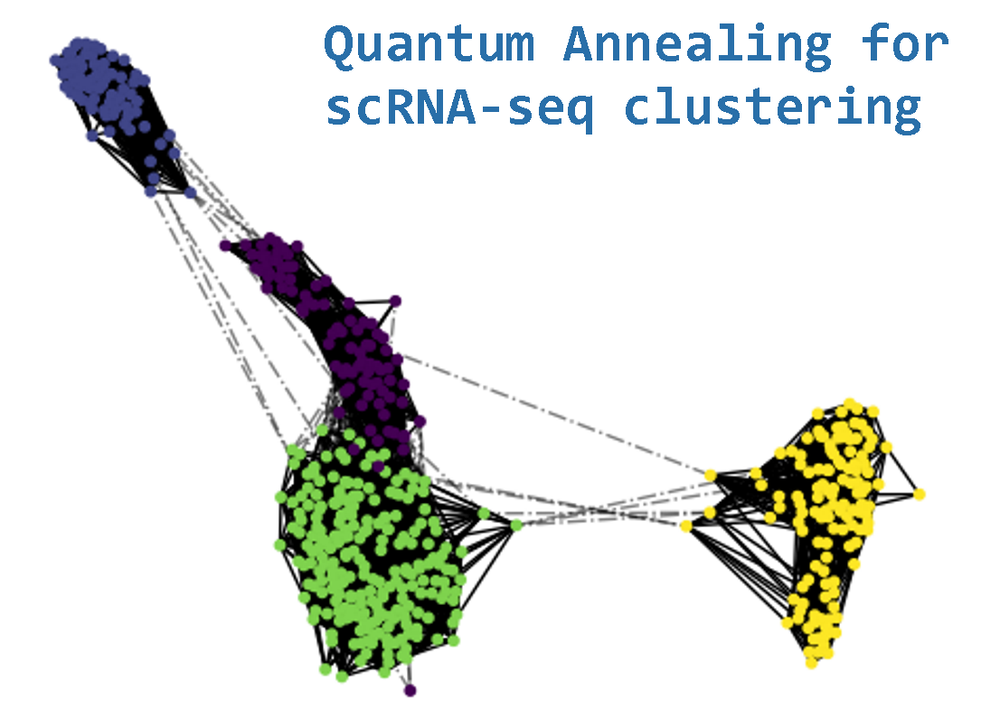
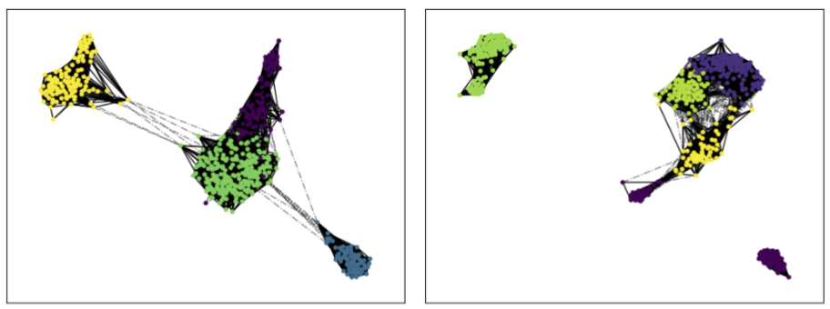
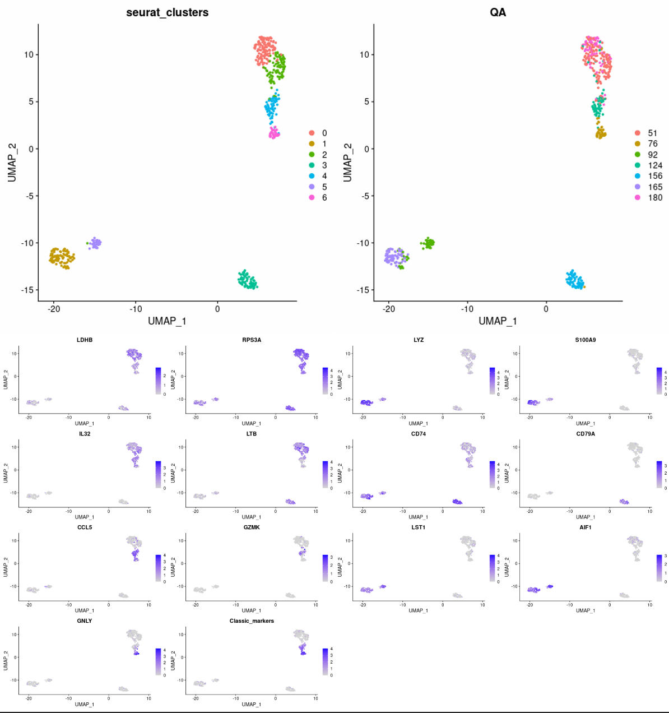

The project uses Dwave Advantage QPU
## Installation

The project can be opened using [Dwave IDE workspace](https://ide.dwavesys.io/workspaces/) or can be configured [locally](https://docs.ocean.dwavesys.com/projects/system/en/stable/installation.html).

```bash
pip install dwave-system
```

## Usage

Data are provided in either .csv edge list format or networkx .gxef file.  
Input graphs were generated using the Seurat SNN on the preprocessed PBMC scRNA data.

## Contributing


## License


## PrintOuts



