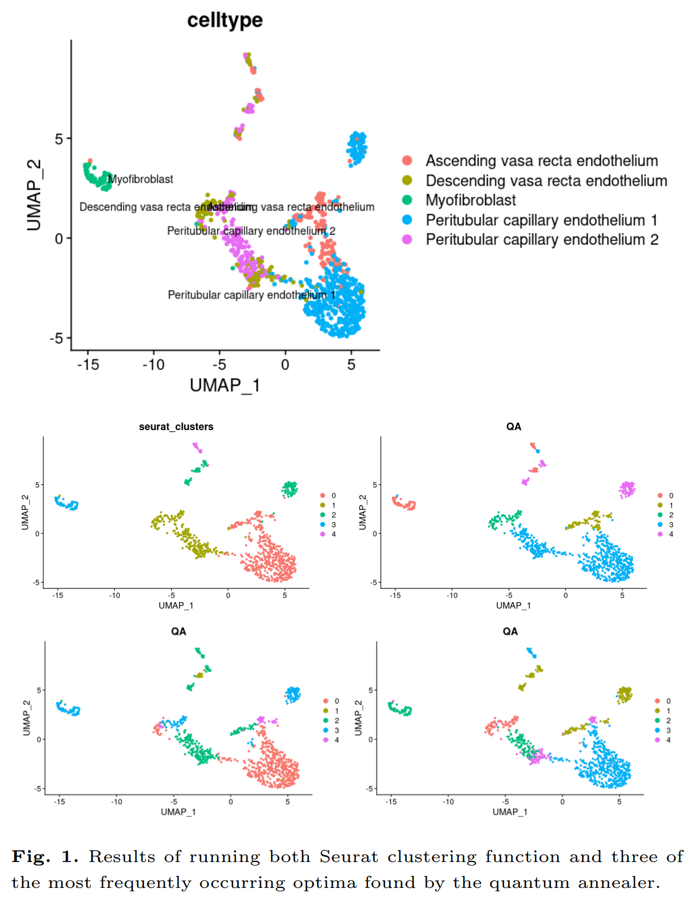
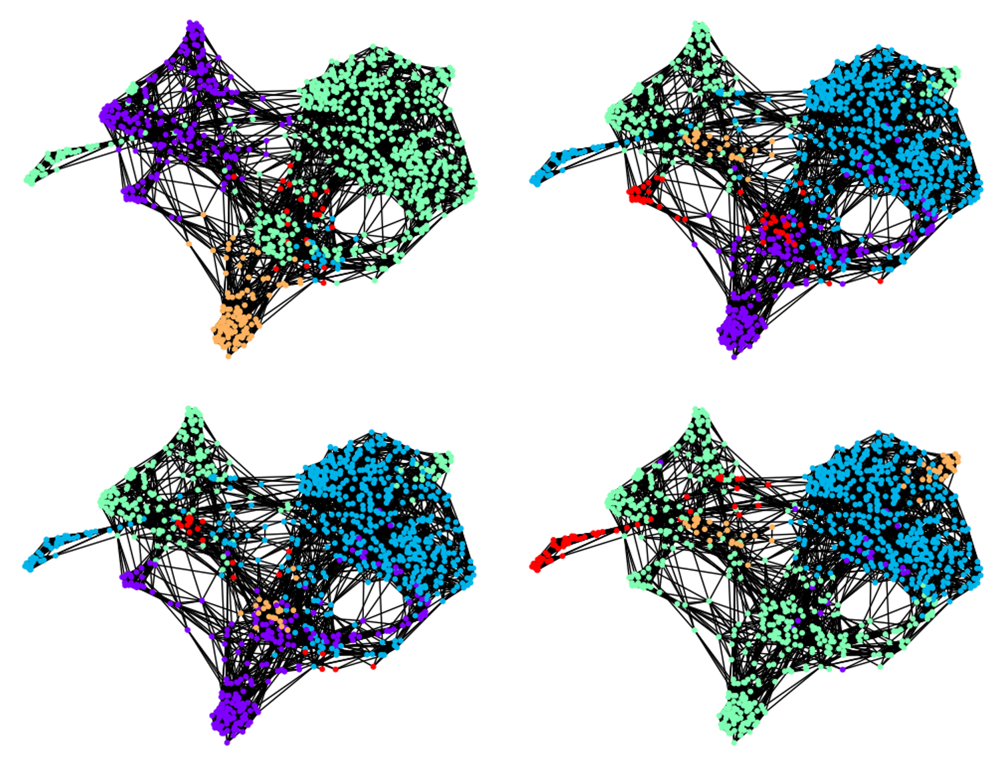
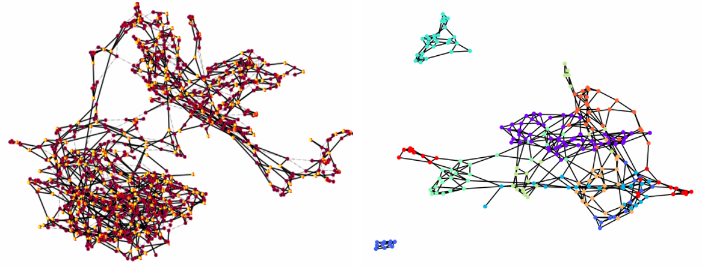

The project uses Dwave Advantage QPU
## Installation

The project can be opened using [Dwave IDE workspace](https://ide.dwavesys.io/workspaces/) or can be configured [locally](https://docs.ocean.dwavesys.com/en/stable/overview/install.html).

```bash
pip install dwave-ocean-sdk
```

## Usage

Data are provided in either .csv edge list format or networkx .gxef file.  
Input graphs were generated using the Seurat SNN on the preprocessed PBMC scRNA data.

code is in the development stage

## Contributing


## License


## PrintOuts



